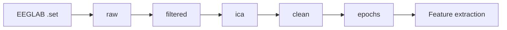

# Preprocessing Pipeline

This document describes the full EEG preprocessing pipeline: staged signal processing, checkpoint layout, configuration, quality control, and how to run it locally or on Kaggle.

**Implementation:** `eeg/preprocessing.py`  
**CLI entry point:** `scripts/preprocess_dataset.py`  
**Kaggle notebook:** `notebooks/kaggle/01_preprocessing.ipynb`

For raw data layout see [DATA.md](DATA.md). For downstream feature extraction see [METHODOLOGY.md](METHODOLOGY.md).

---

## Overview

The pipeline converts raw clinical EEG recordings (EEGLAB `.set` files) into cleaned, epoched MNE objects suitable for biomarker extraction. Processing is **per subject**, **staged**, and **resumable**:

```
raw → filtered → ica → clean → epochs
```

Each stage writes a FIF checkpoint to disk. Subject logs record metrics, timing, and provenance (`raw_sha256`, `config_fingerprint`). Re-runs skip completed subjects when the raw file and experiment config are unchanged.



---

## Input data

| Dataset | Aliases | Task | Raw path pattern |
|---------|---------|------|------------------|
| `eyesclosed` | `2`, `dataset2` | Eyes-closed resting state | `EEG_data/dataset2/sub-NNN/eeg/sub-NNN_task-eyesclosed_eeg.set` |
| `photomark` | `3`, `dataset3` | Eyes-open photo stimulation | `EEG_data/dataset3/sub-NNN/eeg/sub-NNN_task-photomark_eeg.set` |

Source: [Miltiadous et al. (2023)](https://doi.org/10.3390/data8060095) — 19-channel 10–20 montage, 500 Hz.

Datasets are processed **separately** (`--dataset eyesclosed` or `--dataset photomark`). Use `--dataset all` to run both in one invocation.

---

## Stages

### 1. Raw (`stage_raw`)

**Checkpoint:** `sub-NNN_raw.fif`

| Step | Detail |
|------|--------|
| Load | `mne.io.read_raw_eeglab()` for `.set` files |
| Resample | To `configs/features.yaml` → `sampling_rate` (default **500 Hz**) if needed |
| Montage | Legacy alias rename (T3/T4/T5/T6) + `set_montage("standard_1020")` |
| Metadata | Duration (s), sample rate, channel counts, `montage_set` |

### 2. Filtered (`stage_filtered`)

**Checkpoint:** `sub-NNN_filtered_raw.fif`

| Step | Detail |
|------|--------|
| Bad channels | Std-based detection: flat if `std < flat_std`; noisy if `std > median_std × noisy_z`. Marked in `info["bads"]` — **not** interpolated yet. |
| Band-pass | **0.5–40 Hz**, FIR (`firwin`), `picks` exclude bad channels |
| Notch | **50 Hz** (when `notch_filter: true`), `picks` exclude bad channels |

Controlled by `experiment.filtering` and `experiment.preprocessing.freq_filter` / `notch_filter`.

### 3. ICA (`stage_ica`)

**Checkpoint:** `sub-NNN_ica_raw.fif`

Skipped when `run_ica: false` (e.g. `fast` experiment).

| Step | Detail |
|------|--------|
| Pre-filter | 1 Hz high-pass on a copy (ICA input only) |
| Fit | `ICA(method="infomax")`, `n_components = n_EEG - 1` when `ica_n_components: auto` |
| Artifact detection | EOG via Fp1/Fp2 (`threshold=3.0`); ECG if `ECG` channel present |
| Apply | Excluded components removed from continuous data |
| Guard | Skipped if recording &lt; 30 s; warns if fitted components &lt; 50% of EEG channels |

Random seed: `ica_random_state` (default **97**).

### 4. Clean (`stage_clean`)

**Checkpoint:** `sub-NNN_clean_raw.fif`

| Step | Detail |
|------|--------|
| Bad channels | Copy `info["bads"]` to log **before** `interpolate_bads(reset_bads=True)` |
| Interpolate | Spherical spline interpolation of detected bad channels |
| ASR | Artifact Subspace Reconstruction (`asrpy.ASR`), `cutoff` default **17**, calibrated on full recording |
| Re-reference | Common average reference (`set_eeg_reference("average")`) when `referencing: true` — applied **after** ASR |
| QC metrics | Band power (δ, θ, α, β, γ) and PSD before/after cleaning vs. raw checkpoint |

### 5. Epochs (`stage_epochs`)

**Checkpoint:** `sub-NNN_epo.fif`

| Step | Detail |
|------|--------|
| Segmentation | Fixed-length epochs: **4 s** windows, **2 s** overlap (`mne.make_fixed_length_epochs`) |
| AutoReject | `autoreject.AutoReject(n_interpolate=[1,2,3,4], random_state=11)`; fit on first ≤20 epochs |
| SNR | Post-AR signal-to-noise estimate stored in subject log |

ERP-locked epoching (`erp: true`) is not implemented in the staged pipeline.

---

## Configuration

Preprocessing is driven by YAML experiment configs in `experiments/`, merged with base configs in `configs/`.

```bash
# Default full pipeline (aligned with Miltiadous et al.)
python scripts/preprocess_dataset.py --dataset eyesclosed --experiment baseline

# Fast dev smoke test (bandpass + epoch + AutoReject only)
python scripts/preprocess_dataset.py --dataset eyesclosed --experiment fast --limit 2
```

### Experiment presets

| Experiment | Description | Key differences from `baseline` |
|------------|-------------|----------------------------------|
| `baseline` | Full pipeline | Notch, ICA, bad channels, avg ref, ASR, AutoReject |
| `fast` | Dev smoke test | Bandpass + epoch + AR only |
| `ica95` | ICA/ASR variant | `asr_cutoff: 20` |
| `no_asr` | Ablation | ASR disabled |
| `no_ref` | Ablation | Average reference disabled |
| `no_overlap` | Ablation | `epoching.overlap: 0.0` |

### `baseline` parameters (reference)

```yaml
pipeline_version: 2
preprocessing:
  freq_filter: true
  notch_filter: true
  bad_channels: true
  referencing: true
  asr: true
  asr_cutoff: 17
  run_ica: true
  ica_n_components: auto
  ica_random_state: 97
  AR: true

epoching:
  length: 4.0
  overlap: 2.0

filtering:
  l_freq: 0.5
  h_freq: 40
  notch_freq: [50]

bad_channels:
  flat_std: 1.0e-15
  noisy_z: 5.0
```

Config is snapshotted in `data/preprocessed/{dataset}/{experiment}/metadata.json` with MNE/Python versions, git commit, and `config_sha256`.

---

## Running the pipeline

### CLI

```bash
# Full dataset, parallel workers
python scripts/preprocess_dataset.py --dataset eyesclosed --experiment baseline --workers 4

# Single subject
python scripts/preprocess_dataset.py --dataset eyesclosed --experiment baseline --subject sub-001

# First N subjects (validation)
python scripts/preprocess_dataset.py --dataset eyesclosed --experiment baseline --limit 5

# Force reprocess (ignore checkpoints)
python scripts/preprocess_dataset.py --dataset eyesclosed --experiment baseline --force

# Generate per-subject QC PNGs after preprocessing
python scripts/preprocess_dataset.py --dataset eyesclosed --experiment baseline --qc-plots
```

### Orchestrator

```bash
python pipeline.py --dataset eyesclosed --experiment baseline --stages preprocess --workers 4
```

### Kaggle notebook

`notebooks/kaggle/01_preprocessing.ipynb` supports three modes:

| Mode | Purpose | Output |
|------|---------|--------|
| `inspect` | One subject, QC plots | `/kaggle/working/test_output/inspect/` |
| `test` | First N subjects, validation | `/kaggle/working/test_output/test/` |
| `full` | Entire dataset | `data/` → publish as Kaggle Dataset |

---

## Outputs

All artifacts live under `data/preprocessed/{dataset}/{experiment}/`:

```
data/preprocessed/eyesclosed/baseline/
├── sub-001_raw.fif
├── sub-001_filtered_raw.fif
├── sub-001_ica_raw.fif
├── sub-001_clean_raw.fif
├── sub-001_epo.fif
├── metadata.json
├── logs/
│   └── sub-001.json
└── qc/
    ├── summary.csv
    ├── summary.json
    ├── dataset_report.md
    ├── index.html
    └── sub-001.png          # when --qc-plots
```

### Subject log (`logs/sub-NNN.json`)

Each log includes:

- `participant_id`, `status` (`ok` | `skipped` | `error`)
- `raw_sha256`, `config_fingerprint`
- `stages_completed`, per-stage `runtime_s` and metrics
- Flattened QC fields: bad channels, ICA stats, epoch rejection %, SNR, band-power metrics (µV²/Hz and log10)

Spectral QC columns in `summary.csv` use explicit units:

| Column pattern | Unit | Example |
|----------------|------|---------|
| `{band}_before_uv2`, `{band}_after_uv2`, `{band}_delta_uv2` | µV²/Hz | `alpha_before_uv2` = 12.48 |
| `{band}_before_log10`, `{band}_after_log10` | log10(V²/Hz) | `alpha_before_log10` = -7.42 |
| `psd_mean_before_uv2`, `psd_mean_after_uv2` | µV²/Hz | cohort mean PSD |
| `psd_ratio_after_before` | unitless | clean / raw ratio |

Bands: `delta`, `theta`, `alpha`, `beta`, `gamma` (gamma capped at 40 Hz).

### Dataset QC report (`qc/`)

Generated automatically after each batch run via `eeg/preprocess_report.py`:

| File | Contents |
|------|----------|
| `summary.csv` | One row per subject (flattened metrics) |
| `summary.json` | Cohort distributions, outliers, failures |
| `dataset_report.md` | Human-readable report with ASCII histograms |
| `index.html` | Sortable dashboard with QC thumbnails |

---

## Quality control

### Inspect one subject

```bash
python scripts/inspect_preprocessing.py --dataset eyesclosed --experiment baseline --subject sub-001
```

Prints JSON metrics and saves a 4-panel PNG:

1. **Raw vs clean PSD** (Fp1, Fp2, F7, Cz)
2. **AutoReject** rejection count / percentage
3. **First retained epoch** waveform
4. **Summary panel** — bad channels, SNR, ICA, band-power deltas

QC reads checkpoints and logs only — it does **not** re-run preprocessing.

### Regenerate spectral QC (existing checkpoints)

If subject logs were written before the µV² scaling fix, backfill spectral metrics from `raw` + `clean` checkpoints without re-running filtering, ICA, ASR, or epoching:

```bash
python scripts/regenerate_qc.py --dataset eyesclosed --experiment baseline
python scripts/regenerate_qc.py --dataset eyesclosed --experiment baseline --limit 5
```

This patches `logs/sub-NNN.json` and regenerates `qc/summary.csv`, `summary.json`, and `index.html`.

### Outlier detection (cohort level)

`preprocess_report` flags subjects when:

- Epoch rejection % &gt; mean + 2σ across the cohort
- ICA removed all fitted components

### Compare experiments

```bash
python scripts/compare_experiments.py --dataset eyesclosed --experiments baseline,no_asr,fast
```

---

## Resume and idempotency

The pipeline is designed for long batch runs and interrupted jobs.

1. Each subject log stores `raw_sha256` (hash of source `.set`) and `config_fingerprint` (SHA256 of merged config, including `pipeline_version`).
2. On re-run, `_furthest_valid_stage()` finds the latest checkpoint whose log matches both hashes.
3. Processing resumes from the next incomplete stage.
4. If `epochs` checkpoint is valid, the subject is **skipped** entirely.
5. `--force` bypasses all checks and reprocesses from scratch. Use `--force` after bumping `pipeline_version` or changing preprocessing logic so old checkpoints are invalidated.

Legacy checkpoint names (`_filtered.fif`, `_ica.fif`, `_clean.fif`) are still read for resume compatibility.

---

## Random seeds

| Component | Seed | Config key |
|-----------|------|------------|
| ICA | 97 | `ica_random_state` |
| AutoReject | 11 | hardcoded in `stage_epochs` |
| Global repro | 42 | `configs/training.yaml` → `random_state` |

---

## Dependencies

| Package | Role |
|---------|------|
| [MNE-Python](https://mne.tools/) | I/O, filtering, ICA, epoching, PSD |
| [autoreject](https://autoreject.github.io/) | Automatic epoch rejection |
| [asrpy](https://github.com/wmvanvliet/asrpy) | Artifact Subspace Reconstruction |
| NumPy | Array operations |

Versions are recorded in `metadata.json` and QC fingerprints (`mne_version`, `autoreject_version`, `asrpy_version`).

---

## Code map

| Module | Responsibility |
|--------|----------------|
| `eeg/preprocessing.py` | Stage functions, `preprocess_subject()`, checkpoint chain |
| `scripts/preprocess_dataset.py` | CLI, parallel batch runner |
| `eeg/paths.py` | Checkpoint and log path resolution |
| `eeg/io.py` | EEGLAB load, FIF save/load, SHA256 |
| `eeg/qc.py` | Band power, SNR, log flattening, spectral QC backfill |
| `eeg/preprocess_report.py` | Cohort-level QC reports |
| `eeg/visualization.py` | Per-subject QC panels |
| `eeg/config.py` | Experiment YAML merge, config fingerprint |
| `scripts/inspect_preprocessing.py` | Single-subject QC CLI |
| `scripts/regenerate_qc.py` | Backfill spectral QC from checkpoints |

### Legacy API

`preprocess_EEG()` in `eeg/preprocessing.py` is a single-call wrapper used by older tests and `util/qc.py`. New code should use `preprocess_subject()` and the staged checkpoint API.

---

## Next stage

Preprocessed epochs feed directly into feature extraction:

```bash
python scripts/extract_features.py --dataset eyesclosed --experiment baseline
```

Features are computed per epoch from `sub-NNN_epo.fif` checkpoints. See [METHODOLOGY.md](METHODOLOGY.md#feature-extraction).
